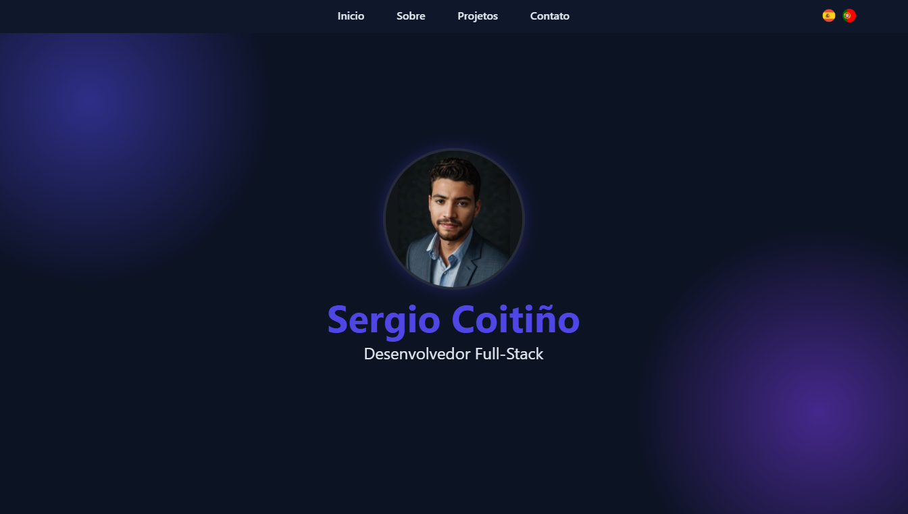

# 🌐 Portafolio Personal - Sergio Coitiño

Este es mi portafolio web desarrollado en **React**, donde presento mis proyectos, habilidades y experiencia profesional. El objetivo es ofrecer una carta de presentación clara, moderna y accesible para reclutadores, clientes y colaboradores.

---

## 🚀 Tecnologías utilizadas

- **React JS**
- **JavaScript (ES6+)**
- **HTML5**
- **CSS3**
- **Create React App**
- **Git & GitHub**

---

## 📸 Vista previa
 

---

## 📁 Estructura del proyecto

